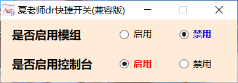

# 夏老师dr快捷开关使用说明

## 这是什么？

是一个《以撒的结合：忏悔》快捷开启和关闭mod、控制台，省去修改配置文件的繁琐步骤的轻量小工具。

## 如何安装？

下载后双击启动运行即可。

## “兼容版”是什么意思？

部分用户可能将“我的文档”文件夹迁移到D盘或其他位置，导致最初版本无法识别而失效。兼容版采用新的方式获取游戏配置文件目录，可以在“我的文档”被移动的情况下依然可用。

## 运行截图

## 联系我

QQ：**1391070463**

百度贴吧、Bilibili、Steam同ID：**@炎炎夏日Quincy**